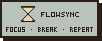

# FlowSync

A retro pixel-art productivity timer with a twist: instead of forcing you into rigid pomodoro blocks, the stopwatch mode lets you **ride your flow and earn your breaks**. Your data is end-to-end encrypted — the server never sees your tasks in plaintext.

**Live at [flowsync.duckdns.org](http://flowsync.duckdns.org)**



## The Stopwatch Idea

Classic pomodoro interrupts you every 25 minutes — even when you're in the zone. FlowSync's stopwatch mode flips the model (sometimes called *flowtime*):

1. **START** the stopwatch and work as long as your focus lasts.
2. **STOP** when you naturally lose steam — FlowSync tells you how much break you earned.
3. Take the earned break with one tap. When it ends, you're back on the stopwatch.

Break rewards are driven by fully editable rules (work ≥ X minutes → Y minute break):

| Worked | Break earned |
| --- | --- |
| < 25 min | 5 min |
| ≥ 25 min | 6 min |
| ≥ 30 min | 10 min |
| ≥ 40 min | 15 min |
| ≥ 60 min | 20 min |

Prefer structure? Classic **pomodoro mode** is there too, with configurable durations and an optional auto-switch that rolls focus → break → focus without pressing START.

## Features

- **Three timer modes** — stopwatch (flowtime), pomodoro, and break — with a pixel hourglass that drains in sync with remaining time and a bunny mascot cheering you on
- **Tasks** — a hand-drawn-style checklist; works without an account (stored locally in IndexedDB)
- **BoomBox** — background sound while the timer runs: brown/white/pink noise, rain, thunderstorm, ocean, café, fireplace, plus live [SomaFM](https://somafm.com) radio streams; separate track choices for work and break
- **Themes** — five palettes (espresso, matcha, sunset, lavender, midnight dark mode) switchable from the navbar, driven by a single token file
- **Timer persistence** — signed-in timers survive reloads and closed tabs; drift is recomputed from wall-clock time
- **End-to-end encryption** — see below

## End-to-End Encrypted Database

FlowSync is designed so that **the server (and its database) can never read your tasks or timer data**. All cryptography happens in the browser via [libsodium](https://doc.libsodium.org/).

### Key derivation — one password, two keys

On signup/login the browser derives 64 bytes from your password with **Argon2id** (`crypto_pwhash`, per-user random salt) and splits them:

```
password + salt ──Argon2id──▶ 64 bytes
                              ├─ authKey (32 B)        → sent to server, hashed again (SHA-256) and stored
                              └─ encryptionKey (32 B)  → NEVER leaves the browser
```

The server only ever sees the `authKey` — never your password, and never the `encryptionKey`.

### The wrapped data key

At signup the browser generates a random 32-byte **dataKey** and *wraps* (encrypts) it with the `encryptionKey` using XSalsa20-Poly1305 (`crypto_secretbox`). Only the wrapped blob is stored server-side. On login the server returns the wrapped key and the browser unwraps it locally — so the plaintext `dataKey` exists only in your browser.

### Encrypted at rest, opaque in transit

Every task and timer record is serialized, encrypted with the `dataKey` (fresh random nonce per write), and only then sent to the API. The SQLite schema reflects this — data columns hold ciphertext:

```sql
tasks( id, userId, data /* ciphertext */, nonce )
users( id, username, data /* encrypted timer state */, nonce )
```

A database dump yields usernames and Base64 noise. Reads are decrypted client-side after fetch.

**Trade-off to know about:** there is no password recovery. The `encryptionKey` derives from your password, so losing the password means the wrapped `dataKey` — and your data — cannot be decrypted. That's the point.

### Session security

- Short-lived **JWT access tokens** sent as `Authorization: Bearer` headers
- **Rotating refresh tokens** in `httpOnly` cookies, grouped into token *families* — if a stolen refresh token is ever reused, the whole family is revoked and the session dies

## Tech Stack

| Layer | Choice |
| --- | --- |
| Framework | Next.js 16 (App Router, standalone output, Turbopack) |
| UI | React 19, Tailwind CSS v4, [pixel-retroui](https://www.npmjs.com/package/pixel-retroui), Minecraft pixel font |
| Crypto | libsodium (Argon2id, XSalsa20-Poly1305) |
| Database | SQLite via `node:sqlite` (WAL mode) — single file, no external services |
| Guest storage | IndexedDB (`idb`) |
| Validation | Zod on every API boundary |
| Deploy | Docker multi-stage build, `compose.yaml` (host port 5252) |

## Getting Started

```bash
npm install

# required: secret for signing JWTs
export JWT_SECRET="change-me"

npm run dev      # dev server on :3000 (Turbopack)
npm run build    # production build
npm run start    # serve the production build
```

Or with Docker:

```bash
docker compose up --build   # serves on :5252, SQLite persisted in ./data
```

## Project Layout

```
app/
├── page.tsx              Main page: navbar, timer, tasks
├── theme.ts              All color palettes (single source of truth)
├── components/
│   ├── Timer.tsx         Timer state machine + persistence + audio
│   ├── Stopwatch.tsx     Flowtime display + break rules editor
│   ├── BoomBox.tsx       Sound picker (work/break tracks, volume)
│   ├── UserTasks.tsx     Task list (encrypted API or guest IndexedDB)
│   ├── UserProfile.tsx   Login / register / logout
│   └── Contexts.tsx      Settings, break rules, auth contexts
├── api/                  Auth, tasks, and user-data routes
lib/
├── client/api.ts         E2E encryption + authenticated fetch layer
└── server/               SQLite schema, JWT + refresh-token rotation
```
